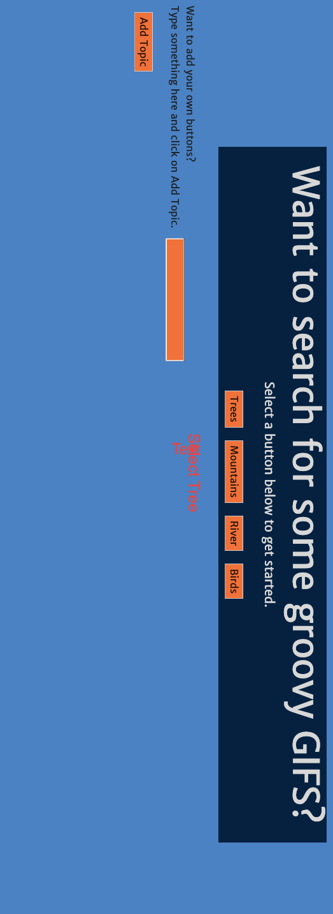
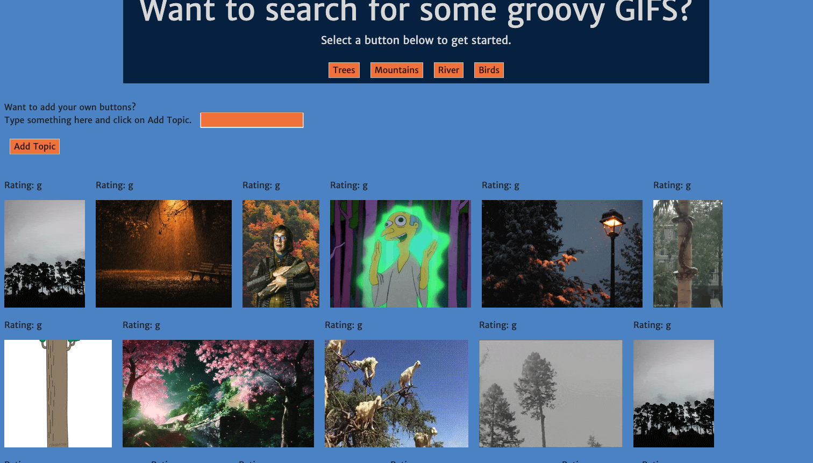
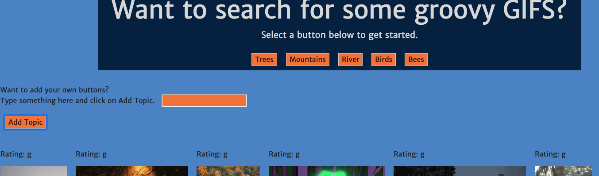
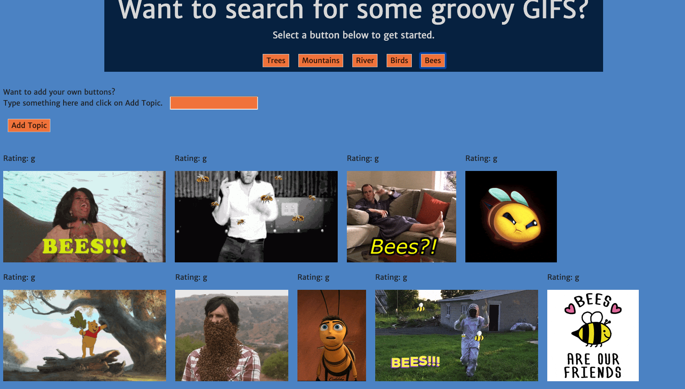

# GifTastic
## This is a front-end application that utilizes ajax to thit the Giphy API to populate gifs based on a given search criteria. Users can add their custom buttons to expand their search options. 

. Technology Used
-HTML, CSS, JavaScript, jQuery, bootstrap, ajax, Font Awesome

